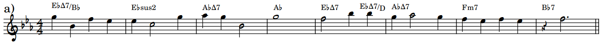
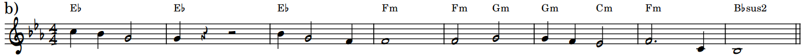
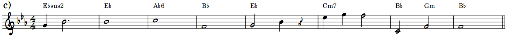
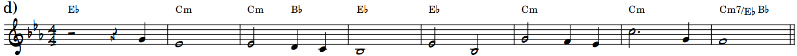
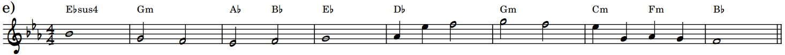
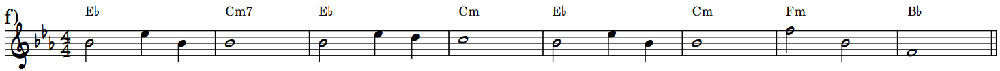
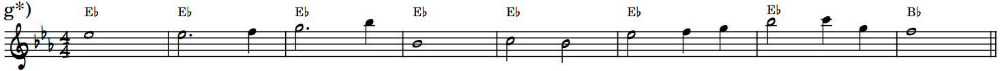
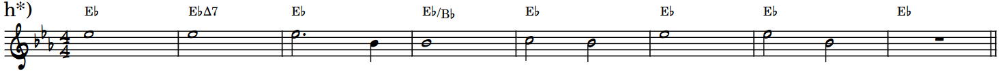
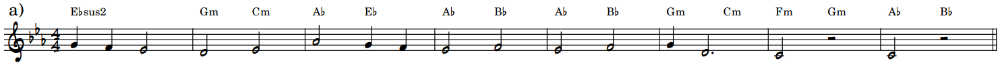
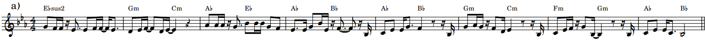

<head>
    <link rel="stylesheet" href="styles.css">
</head>

This is the demo page of the paper under review: *Whole-song Hierarchical Generation of Symbolic Music Using Cascaded Diffusion Models*. We make the first attempt to model full pop songs (melody and piano accompaniment) under the realization of **compositional hierarchy**. 

In particular, we define 4-levels of **hierarchical music languages**, where each level of the hierarchy focuses on the context dependency at certain music scope, from the high-level whole-song form, phrase, and cadence to low-level notes, chords, and their local patterns. A **cascaded diffusion model** is trained to model the hierarchical language, where each level is conditioned on its upper levels.
 

# An Example of Hierarchical Whole-song Generation

Here is a whole-song generation example of 40 bars including melody and accompaniment. We use different background colors to indicate phrase division of its music form, where we see a clear chorus-verse structure.

 <!-- Color Legend -->

  

    

    Intro (<b>i</b>) / Outro (<b>o</b>)
  

  

    

    Verse (Phrase <b>A</b>)
  

  

    

    Chorus (Phrase <b>B</b>)
  

  

    

    Bridge (<b>b</b>)
  

<section class="vis type1">
    <midi-player src="/media/fig2_melacc.mid" sound-font visualizer="#Vis-fig2-melacc"> </midi-player>
    <midi-visualizer src="/media/fig2_melacc.mid" type="piano-roll" id="Vis-fig2-melacc"> </midi-visualizer>
</section>

<button id="toggleButton" class="btn">Show Score</button>

This whole piece is generated by the model in a *top-down* fashion. First, it generates the top-level music language, music ***Form***, which involves <ins>key and phrase division</ins>. The following *Form* visualizes a piece in Ab major (shown as the tonic key and the scale notes) with the phrase division of **i**4**A**4**A**4**B**8**b**4**A**4**B**8**o**4 (4-measure intro, 4-measure phrase A, etc., shown as the background colors).
<section class="type1 alone form">
    <!-- <midi-player src="/media/fig2_form.mid" sound-font visualizer="#Vis-fig2-form"> </midi-player> -->
    <midi-visualizer src="/media/fig2_form.mid" type="piano-roll" id="Vis-fig2-form"> </midi-visualizer>
     
</section>

Next, based on the *Form* above, the model generates the 2nd-level music language, ***Counterpoint***, which involves <ins>reduced melody and simplified chord</ins>. This level of language shows phrase development and structure, including phrase similarity, cadence of phrases using harmony and melody.
<section class="vis type1">
    <midi-player src="/media/fig2_cp.mid" sound-font visualizer="#Vis-fig2-cp"> </midi-player>
    <midi-visualizer src="/media/fig2_cp.mid" type="piano-roll" id="Vis-fig2-cp"> </midi-visualizer>
     
</section>

Then, based on the *Form* and *Counterpoint* above, the model generates the 3rd-level music language, ***Lead Sheet***, which involves <ins>lead melody and chord</ins>. This level of language shows the realization of the actual lead melody and harmony.
<section class="vis type1">
    <midi-player src="/media/fig2_melchd.mid" sound-font visualizer="#Vis-fig2-ls"> </midi-player>
    <midi-visualizer src="/media/fig2_melchd.mid" type="piano-roll" id="Vis-fig2-ls"> </midi-visualizer>
     
</section>

Finally, based on the *Form*, *Counterpoint*, and *Lead Sheet* above, the model generates the final-level music language, piano ***Accompaniment***.
<section class="vis acc type1">
    <midi-player src="/media/fig2_acc.mid" sound-font visualizer="#Vis-fig2-acc"> </midi-player>
    <midi-visualizer src="/media/fig2_acc.mid" type="piano-roll" id="Vis-fig2-acc"> </midi-visualizer>
     
</section>
 

# Variations & Controls on Each Level

With the four-level hierarchical music languages, more abstract music concepts at higher levels are realized by stylistic specifications at lower levels. We show 8-measure generated variations on each level to demonstrate that our generation is diverse, high-quality, and controllable.

## Counterpoint

If we specify to generate an 8-measure verse in Eb major (by setting the top-level language *Form*), the model can generate ***Counterpoint*** in a variety of styles:
<section class="center-stuff alone">
    <!--  -->
    <midi-player src="/media/fig5_a.mid" sound-font visualizer="#Vis-fig5-0"> </midi-player>
    <!--  -->
    <midi-player src="/media/fig5_b.mid" sound-font visualizer="#Vis-fig5-0"> </midi-player>
    <!--  -->
    <midi-player src="/media/fig5_c.mid" sound-font visualizer="#Vis-fig5-0"> </midi-player>
    <!--  -->
    <midi-player src="/media/fig5_d.mid" sound-font visualizer="#Vis-fig5-0"> </midi-player>
    <!--  -->
    <midi-player src="/media/fig5_e.mid" sound-font visualizer="#Vis-fig5-0"> </midi-player>
    <!--  -->
    <midi-player src="/media/fig5_f.mid" sound-font visualizer="#Vis-fig5-0"> </midi-player>
    <midi-visualizer type="piano-roll" id="Vis-fig5-0"> </midi-visualizer>
</section>

**External Control.** Moreover, the style of the generation can be further constrained by a specified *chord progression*. It is encoded by <a href="https://arxiv.org/abs/2008.07122">a pre-trained VAE</a> and cross-attended with the model's layers. Here are the variations conditioned on <ins>consecutive Eb major chords</ins>.
<section class="center-stuff alone">
    <!--  -->
    <midi-player src="/media/fig5_g.mid" sound-font visualizer="#Vis-fig5-1"> </midi-player>
    <!--  -->
    <midi-player src="/media/fig5_h.mid" sound-font visualizer="#Vis-fig5-1"> </midi-player>
    <midi-visualizer type="piano-roll" id="Vis-fig5-1"> </midi-visualizer>
</section>

## Lead Sheet

Under the same *Form* as above, we further specify the *Counterpoint* as follows:

<section class="vis">
    <!--  -->
    <midi-player src="/media/fig6_a.mid" sound-font visualizer="#Vis-fig6-a"> </midi-player>
    <midi-visualizer src="/media/fig6_a.mid" type="piano-roll" id="Vis-fig6-a"> </midi-visualizer>
</section>

The model can generate ***Lead Sheet*** in a variety of styles:
<section class="center-stuff alone">
    <midi-player src="/media/fig6_b.mid" sound-font visualizer="#Vis-fig6-0"> </midi-player>
    <midi-player src="/media/fig6_c.mid" sound-font visualizer="#Vis-fig6-0"> </midi-player>
    <midi-player src="/media/fig6_d.mid" sound-font visualizer="#Vis-fig6-0"> </midi-player>
    <midi-player src="/media/fig6_e.mid" sound-font visualizer="#Vis-fig6-0"> </midi-player>
    <midi-player src="/media/fig6_f.mid" sound-font visualizer="#Vis-fig6-0"> </midi-player>
    <midi-player src="/media/fig6_g.mid" sound-font visualizer="#Vis-fig6-0"> </midi-player>
    <midi-visualizer type="piano-roll" id="Vis-fig6-0"> </midi-visualizer>
</section>

**External Control.** Moreover, the style of the generation can be further constrained by a specified *rhythmic pattern*. It is encoded by <a href="https://arxiv.org/abs/1906.03626">a pre-trained VAE</a> and cross-attended with the model's layers. Here are the variations conditioned on <ins>a dense rhythmic pattern</ins>.
<section class="center-stuff alone">
    <midi-player src="/media/fig6_h.mid" sound-font visualizer="#Vis-fig6-1"> </midi-player>
    <midi-player src="/media/fig6_i.mid" sound-font visualizer="#Vis-fig6-1"> </midi-player>
    <midi-visualizer type="piano-roll" id="Vis-fig6-1"> </midi-visualizer>
</section>

## Accompaniment

Finally, under the same *Form* and *Counterpoint* as above, we further specify the *Lead Sheet* as follows:

<section class="vis">
    <!--  -->
    <midi-player src="/media/fig7_a.mid" sound-font visualizer="#Vis-fig7-a"> </midi-player>
    <midi-visualizer src="/media/fig7_a.mid" type="piano-roll" id="Vis-fig7-a"> </midi-visualizer>
</section>

The model can generate ***Accompaniment*** in a variety of styles (shown with the lead melody):
<section class="center-stuff alone">
    <midi-player src="/media/fig7_b.mid" sound-font visualizer="#Vis-fig7-0"> </midi-player>
    <midi-player src="/media/fig7_c.mid" sound-font visualizer="#Vis-fig7-0"> </midi-player>
    <midi-player src="/media/fig7_d.mid" sound-font visualizer="#Vis-fig7-0"> </midi-player>
    <midi-visualizer type="piano-roll" id="Vis-fig7-0"> </midi-visualizer>
</section>

**External Control.** Moreover, the style of the generation can be further constrained by a specified *musical texture*. It is encoded by <a href="https://arxiv.org/abs/2008.07122">a pre-trained VAE</a> and cross-attended with the model's layers. Here is the variation conditioned on <ins>an Alberti bass texture</ins>, where left hand plays Eb quarter note and the right hand plays Alberti pattern in Eb chord.
<section class="center-stuff alone">
    <midi-player src="/media/fig7_e.mid" sound-font visualizer="#Vis-fig7-1"> </midi-player>
    <midi-visualizer type="piano-roll" id="Vis-fig7-1"> </midi-visualizer>
</section>
 

# More Examples of Whole-song Generation

We list more whole-song samples (lead melody and piano accompaniment) categorized by their phrase division.

 <!-- Color Legend -->

  

    

    Intro (<b>i</b>) / Outro (<b>o</b>)
  

  

    

    Phrase <b>A</b>
  

  

    

    Phrase <b>B</b>
  

  

    

    Bridge (<b>b</b>)
  

- **i**4**A**4**A**4**B**8**b**4**A**4**B**8**o**4
<section class="vis type1">
    <midi-player src="/media/more1_0.mid" sound-font visualizer="#Vis-more1_0"> </midi-player>
    <midi-visualizer src="/media/more1_0.mid" type="piano-roll" id="Vis-more1_0"> </midi-visualizer>
    <midi-player src="/media/more1_1.mid" sound-font visualizer="#Vis-more1_1"> </midi-player>
    <midi-visualizer src="/media/more1_1.mid" type="piano-roll" id="Vis-more1_1"> </midi-visualizer>
     
</section>

- **A**8**B**8**A**8**B**8**B**8
<section class="vis type2">
    <midi-player src="/media/more2_0.mid" sound-font visualizer="#Vis-more2_0"> </midi-player>
    <midi-visualizer src="/media/more2_0.mid" type="piano-roll" id="Vis-more2_0"> </midi-visualizer>
    <midi-player src="/media/more2_1.mid" sound-font visualizer="#Vis-more2_1"> </midi-player>
    <midi-visualizer src="/media/more2_1.mid" type="piano-roll" id="Vis-more2_1"> </midi-visualizer>
     
</section>

- **i**4**A**4**B**4**b**8**A**4**B**4**o**4
<section class="vis type3">
    <midi-player src="/media/more3_0.mid" sound-font visualizer="#Vis-more3_0"> </midi-player>
    <midi-visualizer src="/media/more3_0.mid" type="piano-roll" id="Vis-more3_0"> </midi-visualizer>
    <midi-player src="/media/more3_1.mid" sound-font visualizer="#Vis-more3_1"> </midi-player>
    <midi-visualizer src="/media/more3_1.mid" type="piano-roll" id="Vis-more3_1"> </midi-visualizer>
</section>
 

Thanks <a href="https://cifkao.github.io/html-midi-player/">html-midi-player</a> for the excellent MIDI visualization.

